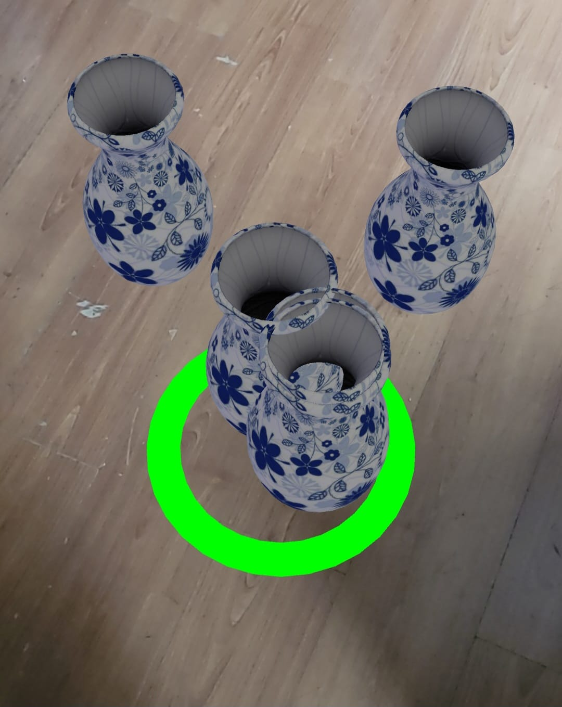

# Aufgabe 2

Besitzer/-in: Methusshan Elankumaran

## Aufgabenstellung:

**Implementiere eine Anwendung, die eine beliebige Anzahl an Vasen auf ebenen Flächen platziert. Es muss nur der Hit-Test implementiert werden, der EventListener zum Laden und Platzieren der Objekte existiert bereits.**

## Ergebnis
